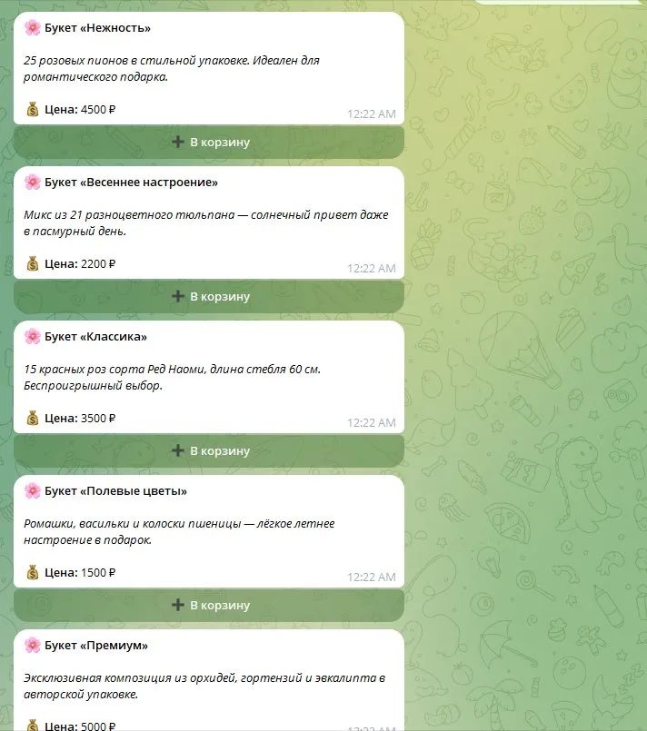
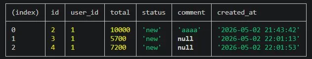
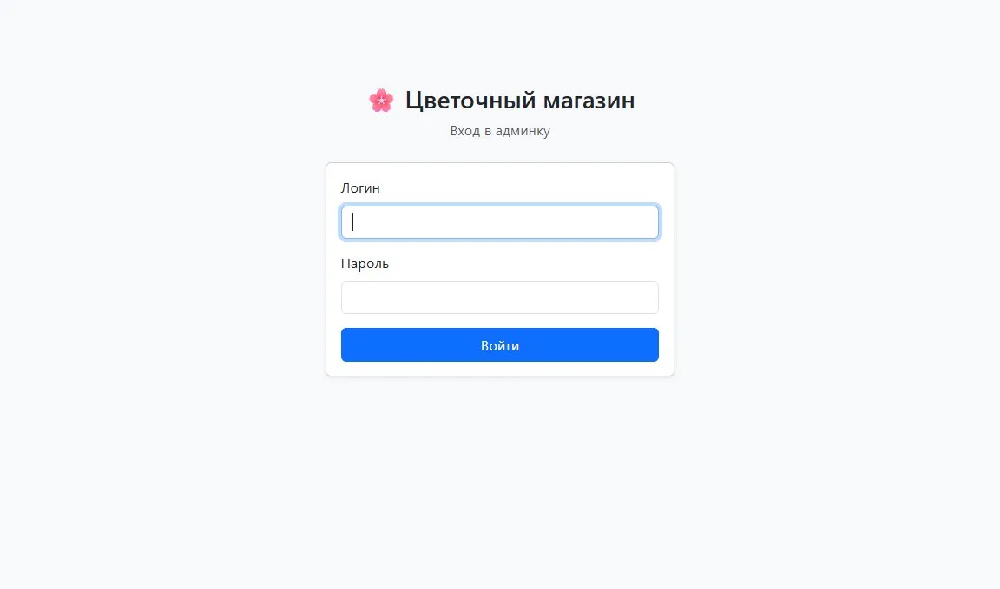
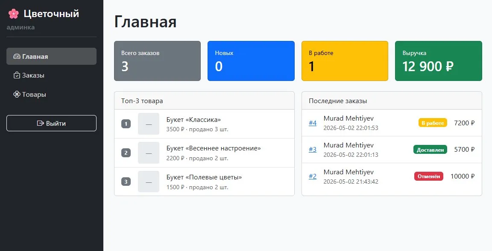
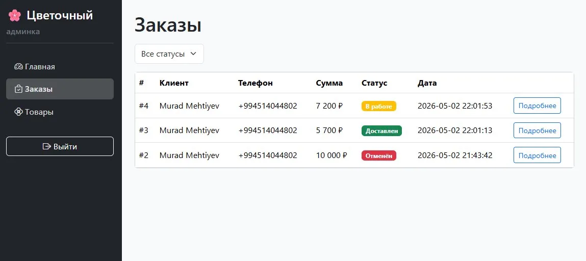
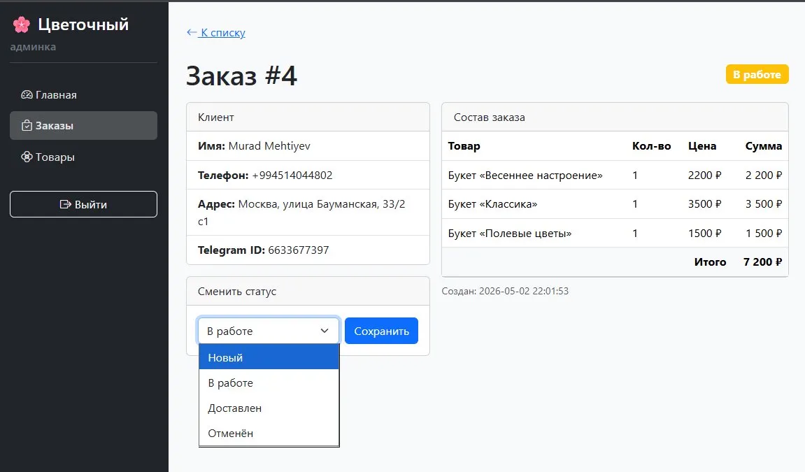
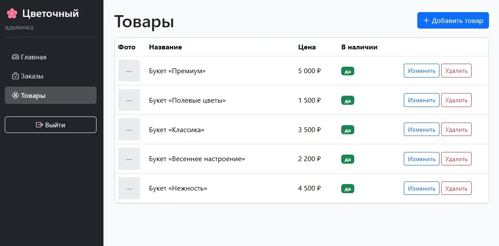
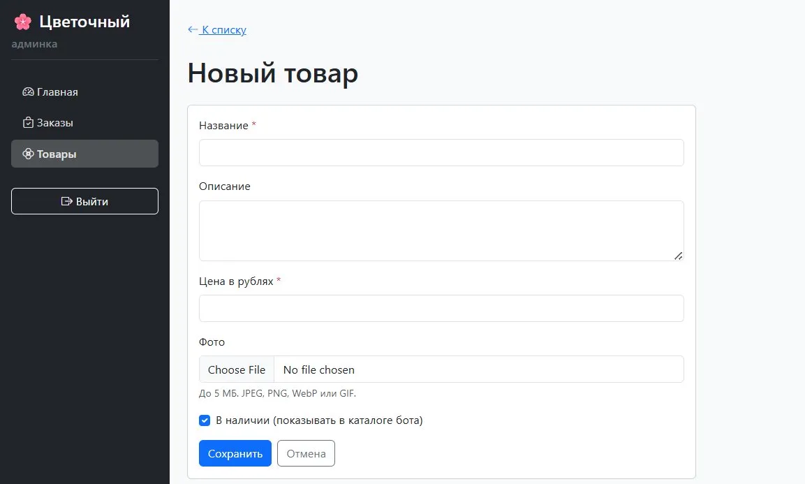
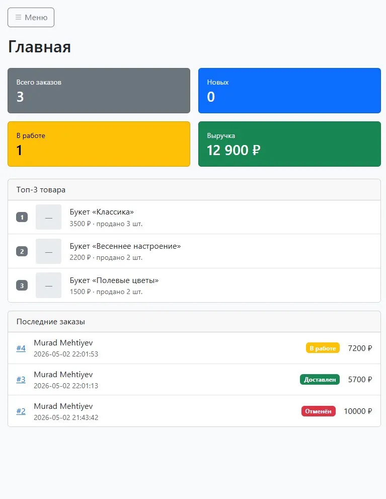

# 🌸 Flower Shop Bot

Telegram-бот цветочного магазина с веб-админкой для управления заказами и товарами.

## 🎯 Описание

Один проект — два сервиса:
- **Бот в Telegram** для покупателей: каталог, корзина, оформление заказа
- **Веб-админка** для владельца: управление заказами, товарами, статистика

Бот и админка работают в одном Node.js-процессе и используют общую БД (SQLite).

## ✨ Возможности

### Для покупателей (Telegram)
- 🌹 Каталог товаров с фото, описаниями и ценами
- 🛒 Корзина с управлением количеством (+/-, очистка)
- 📋 Многошаговое оформление заказа через Wizard scenes
- 📞 Валидация телефона
- 🔁 Сохранение данных постоянных клиентов (`/skip` для быстрого повтора)
- ↩️ Корректное прерывание сцен (отмена, `/start`, кнопки меню)
- 📦 История заказов

### Для администратора (веб-панель)
- 📊 Dashboard со статистикой: всего заказов, новых, в работе, выручка
- 🏆 Топ-3 товара по продажам
- 📋 Список заказов с фильтрами по статусу
- 🔄 Изменение статуса заказа (новый → в работе → доставлен)
- 🌹 CRUD товаров с загрузкой фото (multer)
- 📱 Адаптивный дизайн (offcanvas меню на мобильных)
- 🔒 Сессионная авторизация (логин/пароль через `.env`)
- 🛡 FK-защита от удаления товаров с историей заказов

## 📸 Скриншоты

### Бот в Telegram

<details>
<summary>Раскрыть скриншоты бота (5)</summary>

#### Приветствие и главное меню


#### Каталог букетов


#### Корзина с управлением количеством


#### Многошаговое оформление заказа


#### Заказы в БД


</details>

### Веб-админка

<details open>
<summary>Раскрыть скриншоты админки (7)</summary>

#### Авторизация


#### Dashboard со статистикой


#### Список заказов


#### Деталка заказа


#### Управление товарами


#### Форма создания товара


#### Мобильная версия


</details>

## 🛠 Стек технологий

**Backend:**
- Node.js 24
- Telegraf 4 (Telegram Bot API)
- Express 5 (веб-сервер)
- EJS + express-ejs-layouts (серверные шаблоны)
- better-sqlite3 (БД)
- multer (загрузка файлов)

**Frontend (админка):**
- Bootstrap 5 (через CDN)
- Bootstrap Icons (через CDN)
- Vanilla JavaScript

**Инструменты:**
- dotenv (переменные окружения)
- express-session + cookie-parser (авторизация)
- method-override (PUT/DELETE через формы)

## 🚀 Установка и запуск

### Требования
- Node.js 18+ (рекомендуется 24)
- npm
- Telegram-аккаунт для создания бота

### Шаги

1. Клонируй репозиторий:
   ```bash
   git clone https://github.com/MuradMekhtiev/flower-shop-bot.git
   cd flower-shop-bot
   ```

2. Установи зависимости:
   ```bash
   npm install
   ```

3. Создай файл `.env` на основе `.env.example`:
   ```bash
   copy .env.example .env
   ```
   (на Linux/Mac: `cp .env.example .env`)

4. Получи токен бота:
   - Открой [@BotFather](https://t.me/BotFather) в Telegram
   - Отправь `/newbot`, следуй инструкциям
   - Скопируй полученный токен

5. Заполни `.env`:
   ```env
   BOT_TOKEN=твой_токен_от_BotFather
   ADMIN_USERNAME=admin
   ADMIN_PASSWORD=придумай_свой_пароль
   SESSION_SECRET=длинная_случайная_строка
   PORT=3000
   ```

   Сгенерировать `SESSION_SECRET` можно командой:
   ```bash
   node -e "console.log(require('crypto').randomBytes(64).toString('hex'))"
   ```

6. Заполни БД тестовыми товарами:
   ```bash
   npm run seed
   ```

7. Запусти проект:
   ```bash
   npm run dev
   ```

8. Открой админку: http://localhost:3000

## 📁 Структура проекта

```
flower-shop-bot/
├── index.js                        # Точка входа: запускает бота и Express в одном процессе
├── package.json
├── .env.example                    # Шаблон переменных окружения
├── data.db                         # SQLite БД (создаётся при первом запуске; в .gitignore)
├── public/
│   ├── styles.css                  # Кастомные стили админки поверх Bootstrap
│   └── uploads/                    # Загружаемые фото товаров (в .gitignore, кроме .gitkeep)
├── screenshots/                    # Скриншоты для README
└── src/
    ├── bot.js                      # Логика бота: команды, кнопки, корзина, Wizard scene
    ├── keyboards.js                # Reply и inline-клавиатуры
    ├── db/
    │   ├── index.js                # Подключение SQLite, prepared statements, обёртки
    │   ├── migrations.sql          # CREATE TABLE для всех таблиц
    │   └── seed.js                 # Идемпотентное наполнение БД тестовыми товарами
    └── admin/
        ├── server.js               # Настройка Express, middleware, маршруты
        ├── auth.js                 # Middleware проверки авторизации
        ├── helpers.js              # Константы статусов заказов
        ├── routes/
        │   ├── auth.js             # /login, /logout
        │   ├── dashboard.js        # / — главная
        │   ├── orders.js           # /orders, /orders/:id, смена статуса
        │   └── products.js         # /products — CRUD + загрузка фото
        └── views/                  # EJS-шаблоны
            ├── layout.ejs
            ├── login.ejs
            ├── dashboard.ejs
            ├── error.ejs           # 404/500
            ├── partials/
            │   └── nav.ejs         # Sidebar и offcanvas-меню
            ├── orders/
            │   ├── list.ejs
            │   └── detail.ejs
            └── products/
                ├── list.ejs
                └── form.ejs        # Общая форма для new и edit
```

## 📜 npm-скрипты

| Команда | Что делает |
|---|---|
| `npm run dev` | Запуск с авто-перезапуском (`node --watch index.js`) |
| `npm start` | Обычный запуск без watch |
| `npm run seed` | Наполняет БД 5 тестовыми букетами. Идемпотентно: повторный запуск ничего не делает, если товары уже есть |

## 🗄 Схема БД

SQLite, миграции лежат в [src/db/migrations.sql](src/db/migrations.sql). Все запросы идут через подготовленные выражения (`db.prepare`) для защиты от SQL-инъекций.

| Таблица | Назначение |
|---|---|
| `products` | Каталог букетов: название, описание, цена в рублях, фото, флаг `in_stock` |
| `users` | Покупатели: `telegram_id` (уникальный), имя, телефон, адрес |
| `cart_items` | Корзины: `UNIQUE(user_id, product_id)` — повторное добавление увеличивает `quantity` |
| `orders` | Заказы: сумма, статус (`new` / `in_progress` / `delivered` / `cancelled`), комментарий |
| `order_items` | Позиции заказа. `price` дублируется из `products` на момент оформления, чтобы история не «плыла» при изменении цен |

Цена хранится как `INTEGER` в рублях (без копеек) — это упрощает арифметику и достаточно для демо-проекта.

Транзакция оформления заказа (`createOrderFromCart`) атомарно создаёт строку в `orders`, копирует позиции из `cart_items` в `order_items` и очищает корзину — при любой ошибке всё откатывается.

## 🛣 Маршруты админки

| Метод | Путь | Назначение |
|---|---|---|
| GET | `/login` | Форма входа |
| POST | `/login` | Проверка логина/пароля, создание сессии |
| POST | `/logout` | Уничтожение сессии |
| GET | `/` | Dashboard: KPI + Топ-3 + последние 5 заказов |
| GET | `/orders` | Список заказов, фильтр через `?status=` |
| GET | `/orders/:id` | Деталка заказа |
| POST | `/orders/:id/status` | Смена статуса заказа |
| GET | `/products` | Список товаров (включая снятые с продажи) |
| GET | `/products/new` | Форма создания товара |
| POST | `/products` | Создание товара (с загрузкой фото через `multipart/form-data`) |
| GET | `/products/:id/edit` | Форма редактирования |
| PUT | `/products/:id` | Обновление товара (через `?_method=PUT` благодаря method-override) |
| DELETE | `/products/:id` | Удаление товара (защищено FK от удаления товаров с историей) |

## 🔒 Безопасность

### Что уже есть
- Сессионная авторизация через `express-session`, cookie с `httpOnly` и `sameSite=lax`
- `requireAuth` middleware на всех админских маршрутах
- Все SQL-запросы через `db.prepare` (защита от SQL-инъекций)
- EJS экранирует HTML по умолчанию через `<%= %>` (защита от XSS)
- Whitelist допустимых статусов заказа на сервере
- Multer ограничен 5 МБ и mime-типами `image/{jpeg,png,webp,gif}`
- FK-защита от удаления товаров, на которые есть ссылки в `order_items`
- `.env`, `data.db`, `node_modules`, загруженные фото исключены из репозитория

### Что нужно для продакшена
- Сменить дефолтный пароль и сгенерировать длинный `SESSION_SECRET`
- Хешировать пароль через `bcrypt` (сейчас plain-text в `.env`, см. TODO в [src/admin/routes/auth.js](src/admin/routes/auth.js))
- Поднять HTTPS и включить `cookie.secure = true`
- Заменить in-memory session store на `connect-sqlite3` или `connect-redis`
- Добавить rate limiting на `/login` (`express-rate-limit`)
- Подключить `helmet` для security-заголовков
- Подключить CSRF-защиту для всех POST/PUT/DELETE-форм
- Развести бот и админку на два процесса/сервиса для независимого масштабирования

## 🗺 Roadmap

- [ ] Поиск и пагинация в списке заказов и товаров админки
- [ ] Уведомление в Telegram владельцу о новом заказе
- [ ] Экспорт заказов в CSV / Excel
- [ ] Категории товаров и фильтрация в каталоге бота
- [ ] Промокоды и скидки
- [ ] Несколько админов с ролями (таблица `admins` с `bcrypt`-хешами)
- [ ] Тёмная тема админки
- [ ] Интеграция с платёжной системой (ЮKassa / Stripe)

## 📄 Лицензия

[MIT](./LICENSE) — свободно используйте, модифицируйте и распространяйте.
